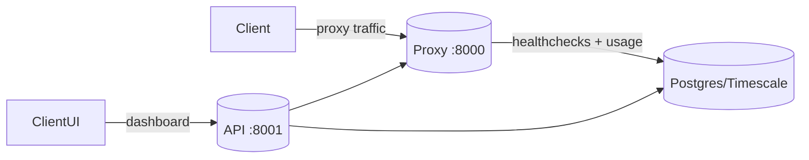
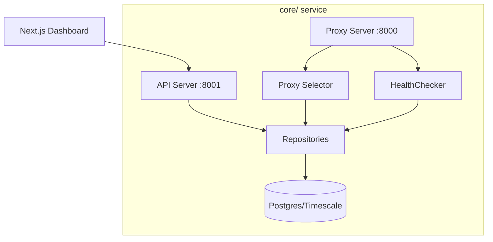
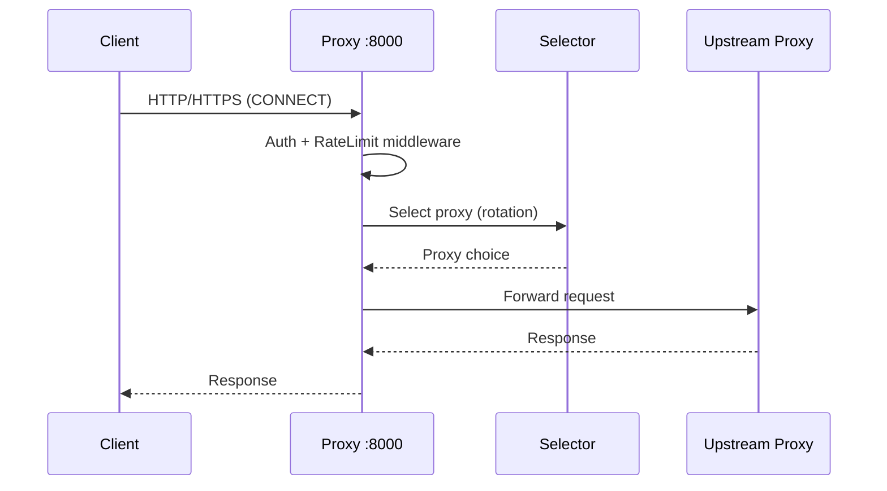
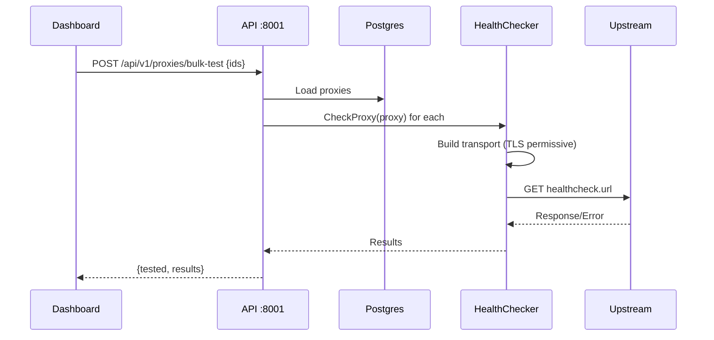
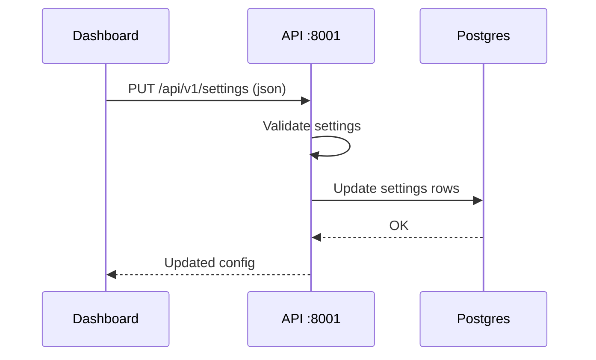
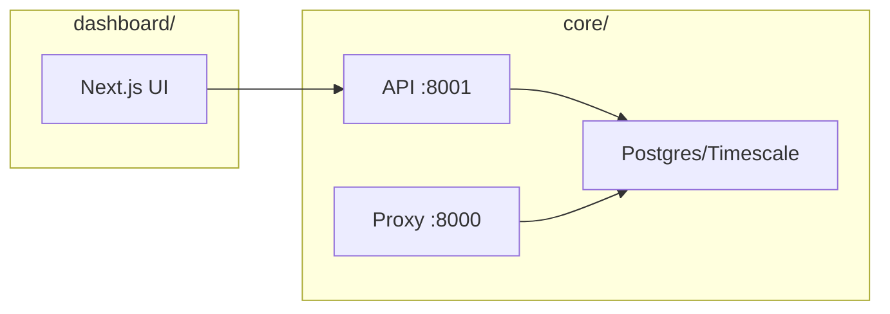

# Rota Technical Overview

This document explains the architecture, code layout, data model, and API surface of the Rota repository so new team members can understand and extend the system quickly.

## Architecture Summary
- **Proxy server** (`core/internal/proxy`) on port **8000**: receives proxy traffic, enforces auth/rate limiting, rotates upstream proxies, tracks usage.
- **API server** (`core/internal/api`) on port **8001**: REST API, websocket feeds, metrics, settings, and dashboard support.
- **Dashboard** (`dashboard/`): Next.js UI that calls the API under `/api/v1/*`.
- **Database**: Postgres/TimescaleDB for settings, proxies, logs, and proxy_requests metrics.

## Runtime Components

## Directory Structure
### Backend (Go) — `core/`
- `core/cmd/server/main.go` — main entrypoint wiring config, DB, API, proxy.
- `core/internal/api` — chi router, middleware, handlers, websocket routes.
- `core/internal/proxy` — proxy server, rotation logic, health check, transport.
- `core/internal/repository` — DB access for proxies, settings, logs, stats.
- `core/internal/models` — DTOs, settings structs, proxy types.
- `core/internal/database` — migrations, DB setup.
- `core/pkg/logger` — structured logger.
- `core/docs` — swagger docs.

### Frontend — `dashboard/`
- `app/` — Next.js routes/pages (dashboard, login, settings, metrics, logs).
- `components/` — UI components.
- `lib/` — API client, types, utils.

### Infrastructure/Docs
- `docker-compose.yml` / `docker-compose.prod.yml` — local/prod stacks.
- `docs/` — usage, deployment, and feature docs.
- `core/scripts/` — testing and utility scripts.

## Configuration
Environment variables are loaded in `core/internal/config/config.go`.
- `PROXY_PORT` (default `8000`)
- `API_PORT` (default `8001`)
- `LOG_LEVEL` (`debug|info|warn|error`, default `info`)
- `DB_HOST` (default `localhost`)
- `DB_PORT` (default `5432`)
- `DB_USER` (default `rota`)
- `DB_PASSWORD` (default `rota_password`)
- `DB_NAME` (default `rota`)
- `DB_SSLMODE` (default `disable`)
- `ROTA_ADMIN_USER` (default `admin`)
- `ROTA_ADMIN_PASSWORD` (default `admin`)

## API Surface (Backend)
Base URL: `http://<host>:8001`

### Public
- `GET /health`
- `GET /docs`
- `GET /api/v1/swagger.json`
- `GET /api/v1/health` (alias)

### Authentication
- `POST /api/v1/auth/login`

### Health & System
- `GET /api/v1/status`
- `GET /api/v1/database/health`
- `GET /api/v1/database/stats`
- `GET /api/v1/metrics/system`

### Proxies
- `GET /api/v1/proxies`
- `POST /api/v1/proxies`
- `POST /api/v1/proxies/bulk`
- `POST /api/v1/proxies/bulk-delete`
- `POST /api/v1/proxies/bulk-test`
- `GET /api/v1/proxies/export`
- `PUT /api/v1/proxies/{id}`
- `DELETE /api/v1/proxies/{id}`
- `POST /api/v1/proxies/{id}/test`
- `POST /api/v1/proxies/reload`

### Dashboard
- `GET /api/v1/dashboard/stats`
- `GET /api/v1/dashboard/charts/response-time`
- `GET /api/v1/dashboard/charts/success-rate`

### Logs
- `GET /api/v1/logs`
- `GET /api/v1/logs/export`

### Settings
- `GET /api/v1/settings`
- `PUT /api/v1/settings`
- `POST /api/v1/settings/reset`

### WebSockets
- `GET /ws/dashboard`
- `GET /ws/logs`

## Proxy Server Endpoints (Port 8000)
- `GET /health` — lightweight liveness JSON.
- Standard proxy protocol handling for HTTP/HTTPS CONNECT.
- Direct passthrough for `/hyperliquid/*` to `https://api.hyperliquid.xyz`.

## Key Workflows
### Proxy Request Flow

### Bulk Proxy Test (Dashboard)

### Settings Update

## Data Model Overview
Key tables (see `core/internal/database/migrations.go`):
- `proxies` — proxy inventory + status, usage stats.
- `proxy_requests` — time series of proxy requests (Timescale hypertable).
- `logs` — application logs (Timescale hypertable).
- `settings` — JSONB config by key.

Important settings keys:
- `authentication` — proxy auth (applies to :8000).
- `rotation` — rotation strategy, retries, fallback, timeouts.
- `rate_limit` — global per-client limiter.
- `healthcheck` — timeout, workers, url, status, headers, `retest_failed_after_minutes`.
- `log_retention` — retention policy.

## Notable Integrations
- **TimescaleDB** used for `logs` and `proxy_requests` for efficient retention/compression.
- **goproxy** handles CONNECT and HTTP proxying in `core/internal/proxy`.

## Operations
Health endpoints:
- Proxy: `http://localhost:8000/health`
- API: `http://localhost:8001/health` or `/api/v1/health`

Recommended checks:
- `curl http://localhost:8001/api/v1/database/health`
- `curl http://localhost:8001/api/v1/proxies`

## How to Navigate the Code
Start here:
- `core/cmd/server/main.go` — app startup and wiring.
- `core/internal/api/server.go` — routes and middleware.
- `core/internal/proxy/server.go` — proxy server implementation.
- `dashboard/lib/api.ts` — frontend API client.
- `dashboard/app/dashboard` — UI pages for logs/metrics/proxies/settings.

## Diagrams (At a Glance)

